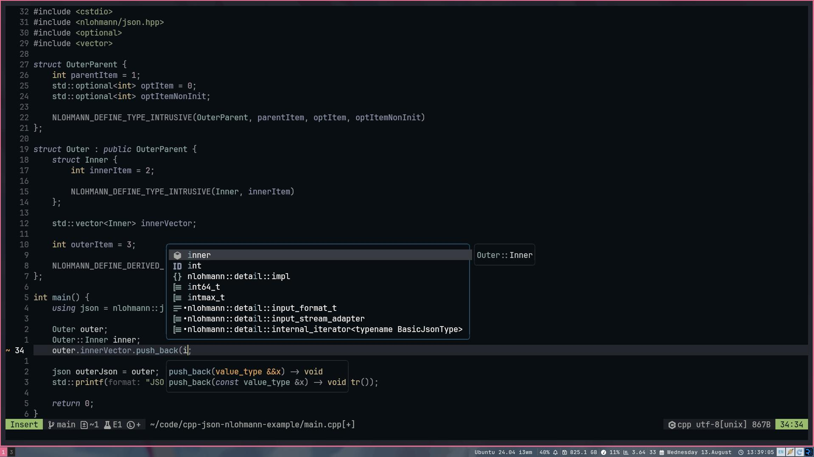

# rozukke dotfiles


My dotfiles for various hardware/software/windowing configurations, meant to be used as a very simple setup with Stow packages.
Safe to say, I have learned a lot from using NixOS.

## Features
- `nvim` configuration based for Neovim 0.11 with no `nvim-lspconfig`, distantly based on `kickstart-nvim`.
- `.zshrc` with sane defaults.
- simple `sway`, `kitty`, `waybar`, `i3` (and `i3status`) and `rofi` configuraton with nice colors.
- `kmonad` remap to colemak-dh and several symbol remaps (space as mod-tap) for a ThinkPad keyboard.

## Setup
Install `stow` if you do not already have it, then:
```sh
cd ~
git clone https://github.com/rozukke/dotfiles.git && cd dotfiles
stow neovim # package name here
```
You may need to remove pre-existing configuration files.

> [!IMPORTANT]
> You probably want to make the cloned directory harder to delete, as the *dotfiles* directory will
contain the actual configuration that is then symlinked into your `XDG_CONFIG_HOME`. Deleting it will
break stuff.

To prevent accidental deletion from happening, run the following command:
```sh
# Require sudo to delete folder
sudo chattr +i ~/dotfiles
```
## Packages
Some packages that may be required for things to work:
- `nvim` will require `fzf unzip ripgrep` and probably others
- `kmonad` with a startup service for the remap(found in extras folder)
- `kitty` for default terminal
